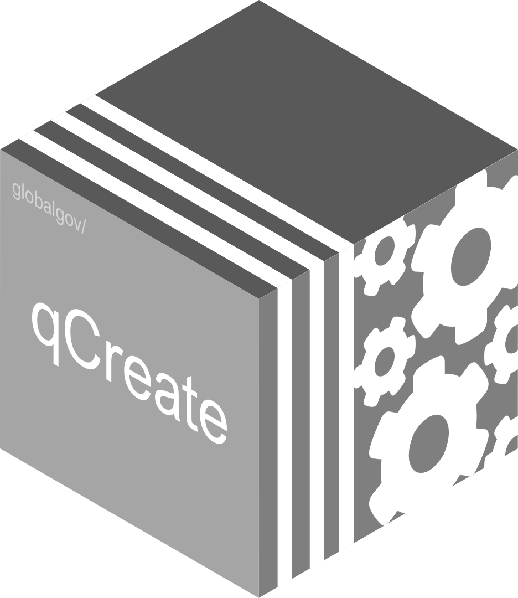

# qCreate 

<!-- badges: start -->

[](https://www.tidyverse.org/lifecycle/#experimental)


<!-- [](http://hits.dwyl.com/globalgov/qData) -->
[](https://codecov.io/gh/globalgov/qCreate?branch=main)
[](https://www.codefactor.io/repository/github/globalgov/qCreate)
[](https://bestpractices.coreinfrastructure.org/projects/4867)
<!--  -->
<!-- badges: end -->

`{qCreate}` is a qPackage in the
[qData](https://github.com/globalgov/qData) ecosystem. It provides
contributors the necessary tools to put their data in the hands of
users. The package includes many functions to make this easier,
including functions to help set up a qPackage, import their existing
data, and export them in structures consistent with the rest of the data
ecosystem. This facilitates the interoperability, contrast, and
comparison of data. There is a specific coding system that should be
followed by contributors. For more details, please see the
[vignette](https://globalgov.github.io/qCreate/articles/developer.html).

## Downloading and installing qCreate

The development version of the package `{qCreate}` can be downloaded
from GitHub.

``` r
# install.packages("remotes")
remotes::install_github("globalgov/qCreate")
```

## Cheat Sheet

<a href="https://github.com/globalgov/qCreate/blob/develop/man/figures/cheatsheet.pdf"></a>

## qPackages

The [qData](https://github.com/globalgov/qData) ecosystem aimed at
collecting, connecting and correcting network data across issue-domains
of global governance. The `qData::get_packages()` function can be used
to discover the qPackages currently available.

``` r
library(qData)
get_packages()
```

    ## Warning: 1 failed to parse.

    ## # A tibble: 5 x 6
    ##   name     full_name         
    ##   <chr>    <chr>             
    ## 1 qCreate  globalgov/qCreate 
    ## 2 qData    globalgov/qData   
    ## 3 qEnviron globalgov/qEnviron
    ## 4 qStates  globalgov/qStates 
    ## 5 qTrade   globalgov/qTrade  
    ##   description                                             installed latest    
    ##   <chr>                                                   <chr>     <chr>     
    ## 1 Support for creating new qPackages                      0.1.1     0.1.0     
    ## 2 An R portal for ensembled global governance data        0.5.0     0.5.0     
    ## 3 qPackage for ensembled data on environmental agreements 0.0.3     0.0.3     
    ## 4 qPackage for ensembled data on sovereign states         0.0.5     0.0.4     
    ## 5 qPackage for ensembled data on trade agreements         0.0.1     Unreleased
    ##   updated   
    ##   <date>    
    ## 1 2021-07-16
    ## 2 2021-07-26
    ## 3 2021-08-03
    ## 4 2021-08-19
    ## 5 NA

Please see [the website](https://globalgov.github.io/qCreate/) for more
information about how to use `{qCreate}` as a developer or as a data
contributor. For more information on `{qData}`, please see [the
website](https://globalgov.github.io/qData/).
