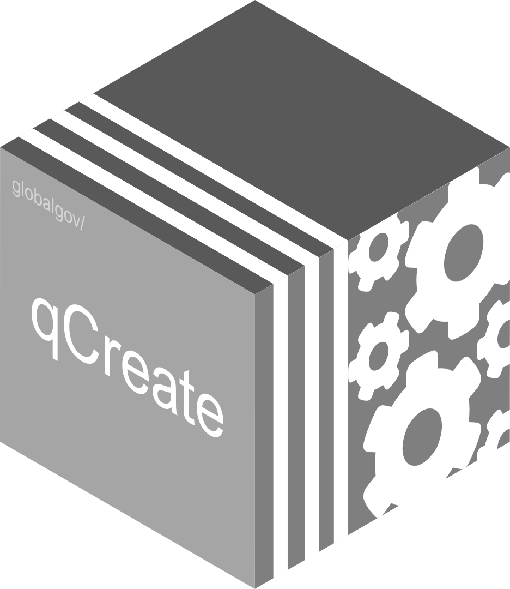

# qCreate 

<!-- badges: start -->

[](https://www.tidyverse.org/lifecycle/#experimental)


<!-- [](http://hits.dwyl.com/globalgov/qData) -->
[](https://codecov.io/gh/globalgov/qCreate?branch=main)
[](https://www.codefactor.io/repository/github/globalgov/qCreate)
[](https://bestpractices.coreinfrastructure.org/projects/4867)
<!--  -->
<!-- badges: end -->

`{qCreate}` provides contributors the necessary tools to put their data
in the hands of users. The package includes many functions to make this
easier. It includes functions to help set up a qPackage, import their
existing data, and export them in structures consistent with the rest of
the data ecosystem. This facilitates the interoperability, contrast, and
comparison of data. Specific coding system should be followed by the
contributors. For more details on that, please see the
[vignette](https://globalgov.github.io/qCreate/articles/developer.html).

## Downloading and installing qCreate

The development version of the package `{qCreate}` can be downloaded
from GitHub.

``` r
# install.packages("remotes")
remotes::install_github("globalgov/qCreate")
```

## qPackages

`{qData}` is the central package in an ecosystem of packages aimed at
collecting, connecting and correcting network data across issue-domains
of global governance. The `{qData}` is designed for users but the
`qData::get_packages()` function in can be used to discover which
packages are currently available.

``` r
library(qData)
```

    ## Warning: package 'tibble' was built under R version 4.0.5

``` r
get_packages()
```

    ## Warning: 1 failed to parse.

    ## # A tibble: 4 x 6
    ##   name     full_name         
    ##   <chr>    <chr>             
    ## 1 qCreate  globalgov/qCreate 
    ## 2 qData    globalgov/qData   
    ## 3 qEnviron globalgov/qEnviron
    ## 4 qStates  globalgov/qStates 
    ##   description                                             installed latest    
    ##   <chr>                                                   <chr>     <chr>     
    ## 1 Support for creating new qPackages                      0.0.1     Unreleased
    ## 2 An R portal for ensembled global governance data        0.4.0     0.3.5     
    ## 3 qPackage for ensembled data on environmental agreements 0.0.2     0.0.2     
    ## 4 qPackage for ensembled data on sovereign states         0.0.3     0.0.3     
    ##   updated   
    ##   <date>    
    ## 1 NA        
    ## 2 2021-03-24
    ## 3 2021-02-22
    ## 4 2021-02-22

Please see [the website](https://globalgov.github.io/qCreate/) for more
information about how to use `{qCreate}` as a developer or a data
contributor. For more information on `{qData}`, please see [the
website](https://globalgov.github.io/qData/).
